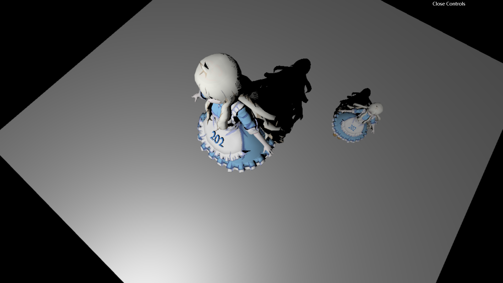
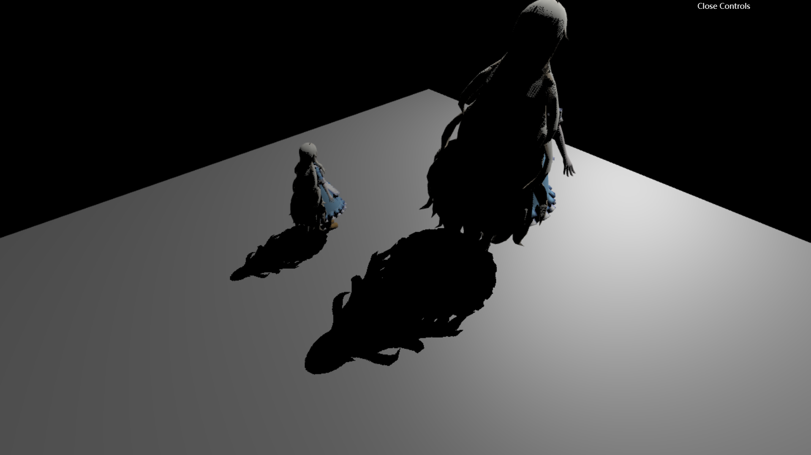
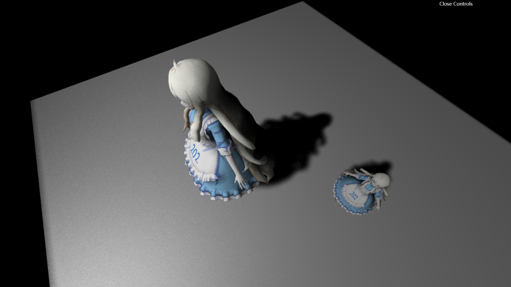
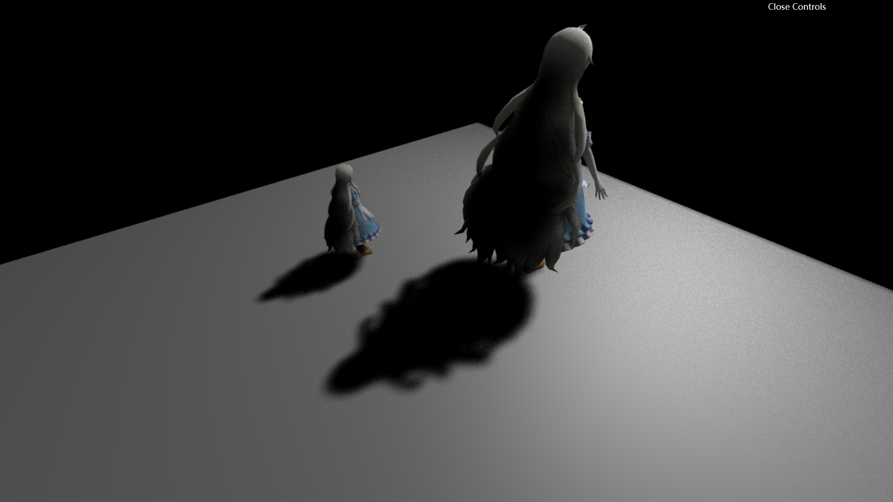
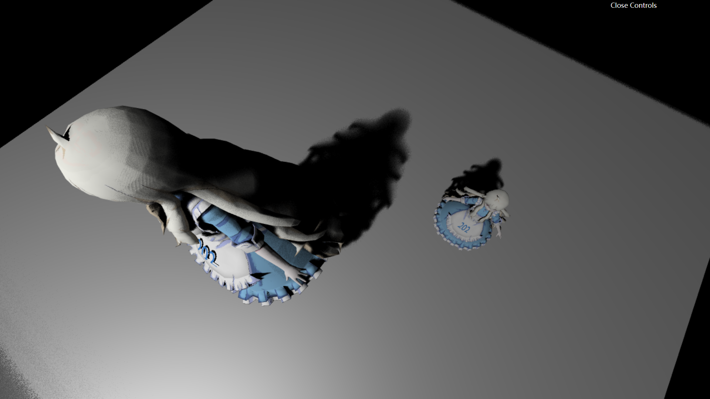
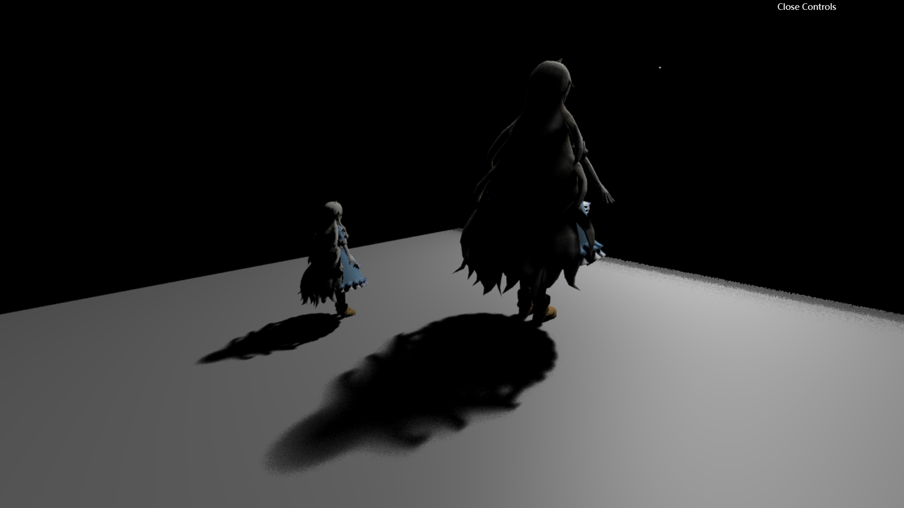

# GAMES202 homework1

## Usage

### For Visual Studio Code
Install plugin `Live Sever` and run with `index.html` directly

### For Node.js users
To install:
```
npm install http-server -g
```
To run(from `index.html` directory):
```
http-server . -p 8000
```

## Reference

[LearnOpenGL CN- 阴影映射](https://learnopengl-cn.github.io/05%20Advanced%20Lighting/03%20Shadows/01%20Shadow%20Mapping/#pcf)

[Learn OpenGL - Shadow Mapping](https://learnopengl.com/Advanced-Lighting/Shadows/Shadow-Mapping)

[NVIDIA - Percentage-Closer Soft Shadows](../reference/shadow_PCSS.pdf)

[NVIDIA - Integrating Realistic Soft Shadows Into Your Game Engine](../reference/PCSS_Integration.pdf)


## Image
### ShadowMap


### PCF


### PCSS




